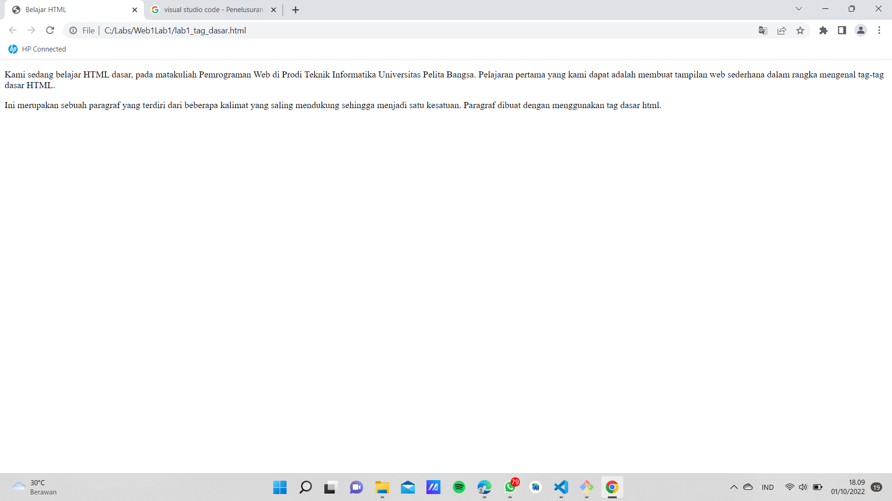
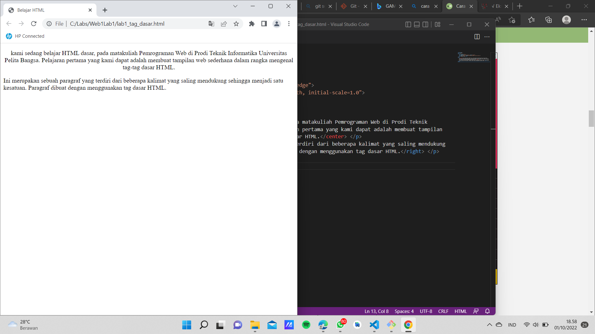
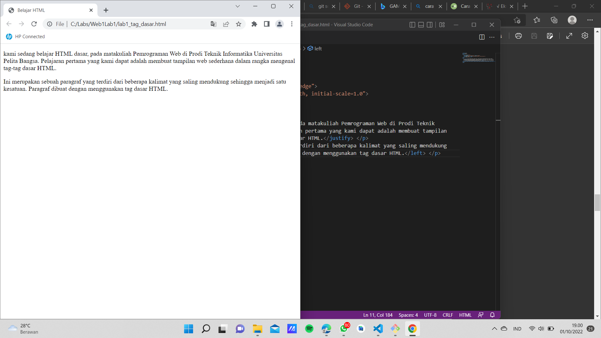
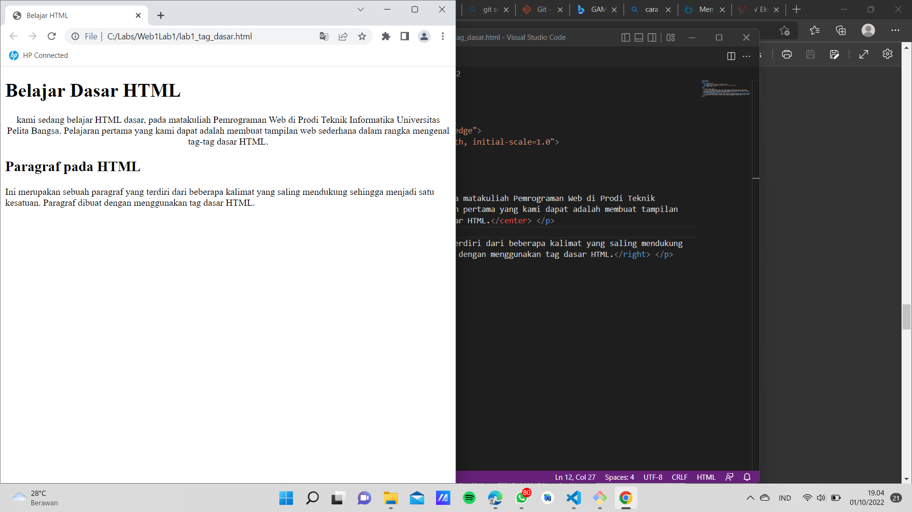

# Web1Lab1
## Belajar Tag Dasar HTML

# Membuat Paragraf
kode tag untuk paragraf adalah '
'
ini adalah tampilannya

# Menambahkan Judul
kode tag untuk judul adalah '<h1>'
kode tag untuk judul adalah '<h2>'
ini adalah tampilannya

# Memformat Teks
kode untuk memformat teks adalah '<mark>'
kode untuk memformat teks adalah '<b>' 
kode untuk memformat teks adalah '<i>'
kode untuk memformat teks adalah '<ins>'
ini adalah tampilannya 
[Gambar 5](Gambar/screenshot/ss5.png)

# Menyisipkan Gambar
kode tag untuk menyisipkan gambar adalah ''
ini adalah tampilannya
[Gambar 6](Gambar/screenshot/ss6.png)

# Menambahkan Hyperlink
kode untuk menambahkan Hyperlink adalah <nav>'
ini adalah tampilannya
[Gambar 7](Gambar/screenshot/ss7.png)